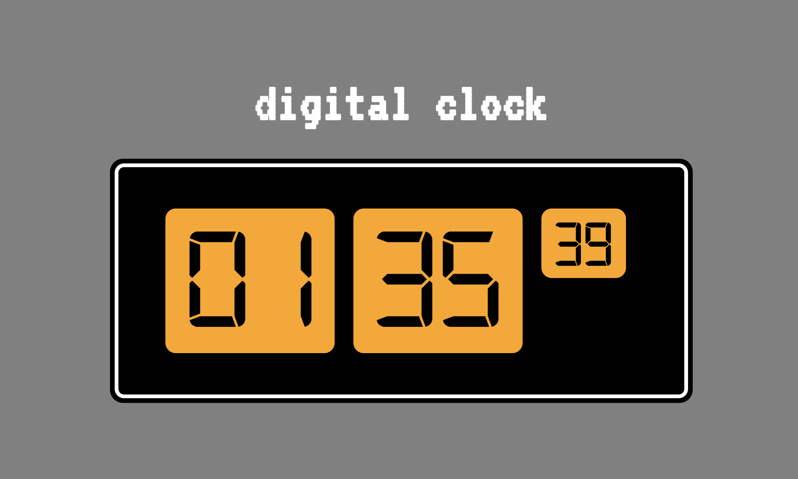
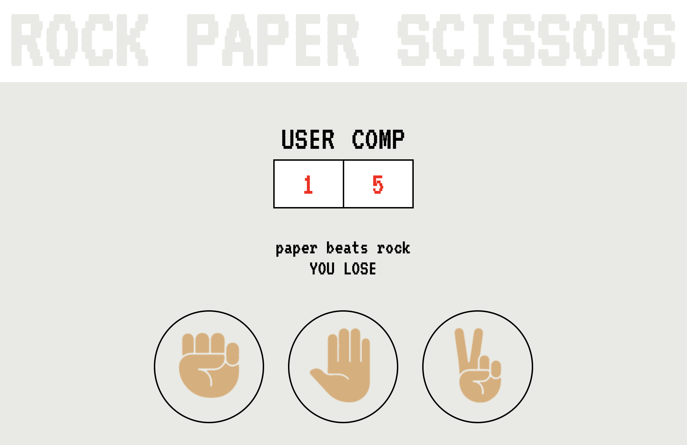
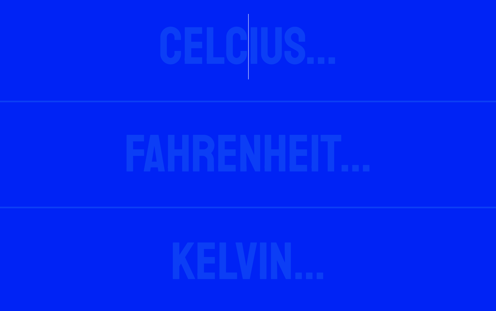

# HTML Projects
This is a collection of little html pages I've made to get some practice using HTML, CSS and JS. 

## Clock
This is a simple digital clock.

## Rock Paper Scissors
This is a web version of Rock, Paper, Scissors where the users plays the computer and the program keeps score.

## Temperature Converter
This is a temperature converter that includes Fahrenheit, Celsius and Kelvin. 
